# My 2 way market place template

Link to the deployed app: https://blooming-basin-18491.herokuapp.com/ 
Link to github repo: https://github.com/Harrisonp365/HpowellT2A2 (Submitted project) https://github.com/Harrisonp365/llacedv2 (project I didnt get to finish was unable to migrate orders model due to AWS IAM keys, this suited the ERD but I was unable to finish.) https://github.com/Harrisonp365/llaced (This was the original I started)

## Section 1: Requirement checklist 

Each time you have completed a requirement check it off the list. This way it will be easy for the educators as well as yourselves to track your progress.

- [/] 1. Create your app using Ruby on Rails.
- [/] 2. Use Postgresql database in development and production.
- [/] 3. My app has authentication (eg. Devise).
- [/] 4. My app has authorisation (i.e. users have restrictions on what they can see and edit).
- [/] 5. My app has some type of file (eg. images) uploading capability.
- [/] 6. My app is deployed to Heroku (recommended) or AWS.
- [/] 7. I have identified the problem I am trying to solve by building this particular marketplace app.
- [/] 8. I have explained why is it a problem that needs solving.
- [/] 9. I have provided a link (URL) to my deployed app (i.e. website)
- [/] 10. I have provided a link to my GitHub repository (repo). I have ensured the repo is accessible by my Educators.
- [/] 11. I have a complete description of my marketplace app (website), including:  
        - 11.1 Purpose  
        - 11.2 Functionality / features  
        - 11.3 Sitemap  
        - 11.4 Screenshots  
        - 11.5 Target audience  
        - 11.6 Tech stack (e.g. html, css, deployment platform, etc)  

- [/] 12. I have provided user stories for my app
- [/] 13. I have provided Wire-Frames for my app 
- [/] 14. I have provided an ERD for my app
- [/] 15. I have explained the different high-level components (abstractions) in my app
- [/] 16. I have listed and described any third party services that your app will use
- [/] 17. I have described my projects models in terms of the relationships (active record associations) they have with each other.
- [/] 18. I have discussed the database relations to be implemented in my application
- [/] 19. I have provided my database schema design
- [/] 20. I have described the way tasks are allocated and tracked in my project

NB Slide/Presentation specific requirements

- [/] 21. An outline of the problem I solved by building this particular marketplace app, and why it’s a problem that needs solving.
- [/] 22. A well planned walkthrough of my app
- [/] 23. I have practived my presentation at least once and it is 5-6 minutes long. 

### Rubric Criteria

## Section 2: Documentation 
NB leave the Titles as they are and answer the questions below.

##### 1. Explain the different high-level components (abstractions) in your App.
* Includes a complete and detailed description of third party services used in the app
In my application I have used many 3rd party services or add ons to help me achieve my goal of creating an easy to use marketplace. From the ground up I have used a ruby gem called “devise”. Devise allows me to hand users logging in and out with their own individual accounts, They can update their passwords using devise and it also handles any issues with forgetting passwords. I used AWS and their gem to handle all of my image uploading, AWS in particular their S3 bucket feature stores all images uploaded by the user. It allows for everything to be stored in amazon's cloud, which allows for very fast upload and download speeds of the images. I have then used Stripe and it’s get for payments. Stripe allows the user to be redirected to stripes website for payments, this is all done via the stripe gem which uses some javascript code to redirect once the buy button is clicked. Stripe has great functionality allowing for webhooks and also checking data and testing. To get back from stripe I need to use a webhook, for this I have used the Ultrahook gem which allows me to set a user endpoint wherever I like, this means I can take the user back to a payment successful page which is back on my application. The big one which allows for deployment is using Heroku. Heroku allows us to deploy our application through github, this means we are very easily able to update and redeploy our application if anything was to change. Heroku also gives me a deployed URL I am able to use in the browser without using localhost. Heroku has great functionality in terms of debugging and helping find other issues that may not have happened when I test locally. 

##### 2. List and describe any 3rd party services.
* Precisely explains and shows understanding of the different high-level components of the app

Heroku:
Heroku is a cloud based deployment platform, it allows me to deploy, manage and run the application online. It integrates with GitHub very easily, this means I am able to update and change parts of the application and push the changes to heroku using continuous integration. Any changes made to the master branch in github will be automatically deployed to heroku. 

AWS S3 Bucket:
Amazon Simple Storage Service (S3) is a cloud based web service which allows me to store images which people upload to an amazon cloud. It uses a REST API which enables the use of standard HTTP CRUD requests, allows users the easy ability to change their listings as they please. S3 allows me to have many listings with many photos stored in S3 buckets without having a slow run time on my application as they are stored in the cloud which enables me to send a request and receive the data faster. To make sure I have the fastest speeds possible I can change my region through AWS to a region closed to me. S3 also gives me the ability to set permissions. If more people were to work on the project I am able to set permissions for what they can and can’t do with user data. If the application were to grow S3 is extremely scalable while still remaining high performing in terms of speed and security of user data. 

Devise: 
Devise is a ruby gem which allows me to use pre written code for user authentication and sign in/ sign up requirements. I can use devise to have a user sign up once and from there they have their own account with their own permissions. It also has functionality to allow users to sign up via 3rd party accounts like facebook or google, devise can remember user passwords or recover user passwords. It can also be altered for instance my application allows a user to set up a username and from then on a user can sign in via their password or username, making the gem extremely versatile. It has built in authentication for emails and passwords, which I am able to change through the initializers folder. Devise also comes with some very useful helper methods that are used throughout the application, to ensure the security of user data. It enables fantastic permissions control through all of this means users can’t alter other users' data. Devise also has other add-on gems that can help with stronger password controllers if you do not want to alter the devise code that has been made by default.

##### 3.1. Identify the problem you’re trying to solve by building this particular marketplace App?
* Demonstrates a full understanding of the problems that exist in a relevant marketplace that needs disrupting

I have chosen to create an application which allows a user to buy and sell shoes. I have found many marketplaces that allow you to sell an item but do not have the ability to say you are looking for an item. This means some items can become stale and may not sell leading to a lower conversion rate on your website. Some larger marketplaces are also very messy without concise ways of searching through the items for sale. This can make it extremely hard or tedious to find what you are after.

##### 3.2 Why is the problem identified a problem that needs solving?
* Demonstrates a full understanding of the problems that exist in a relevant marketplace that needs disrupting

I believe the problems need to be solved in order to create a better way to buy and sell shoes. 
If the application is an easy to use, user friendly website then in turn you may have a higher conversion rate of selling via the website. If a user has the ability to create a listing saying that they want to buy a particular shoe, in a particular size and a certain price then it can make it very easy for a seller to see what either their shoes are worth, if there is a high demand for that particular shoes or even just the sell to that listing. With a higher conversion rate of selling then the website becomes better known, from here you have the ability to scale up the website and in turn make a profit from people using the website.

Selling shoes has become a massive market for people to buy shoes and sell them over and over to turn massive profits. My application is there to make it more accessible to a larger audience in a more intuitive and user friendly manner. 

##### 4. Describe your project’s models in terms of the relationships (active record associations) they have with each other.
* Complete discussion of the project’s models with an understanding of how its active record associations function

The main model for my application is the User model, the user model is the one that has_many listings meaning that a user can have as many listings as the like. These listings are also dependant meaning if the user were to be deleted then so would the listings which are associated with that user. This helps prevent any ophaned listings. Listings then belongs to not only the user but also the category and brand models and it uses their foriegn keys to have a brand and category. A listing also has attached photos but they are not part of the schema as I am able to store them using S3 which is much better, faster and not considered bad practice. My listings also must have a title, description and price otherwise a user will not be able to post it this is due to the validation and presence must be true. This means all of the ad's on the applciation will have some form of description to help users see what they are looking for. The final models are both identical in that both the brands and cateogries models have many listings, this enables all the listings in the database to have a brand or category.  

##### 5. Discuss the database relations to be implemented.
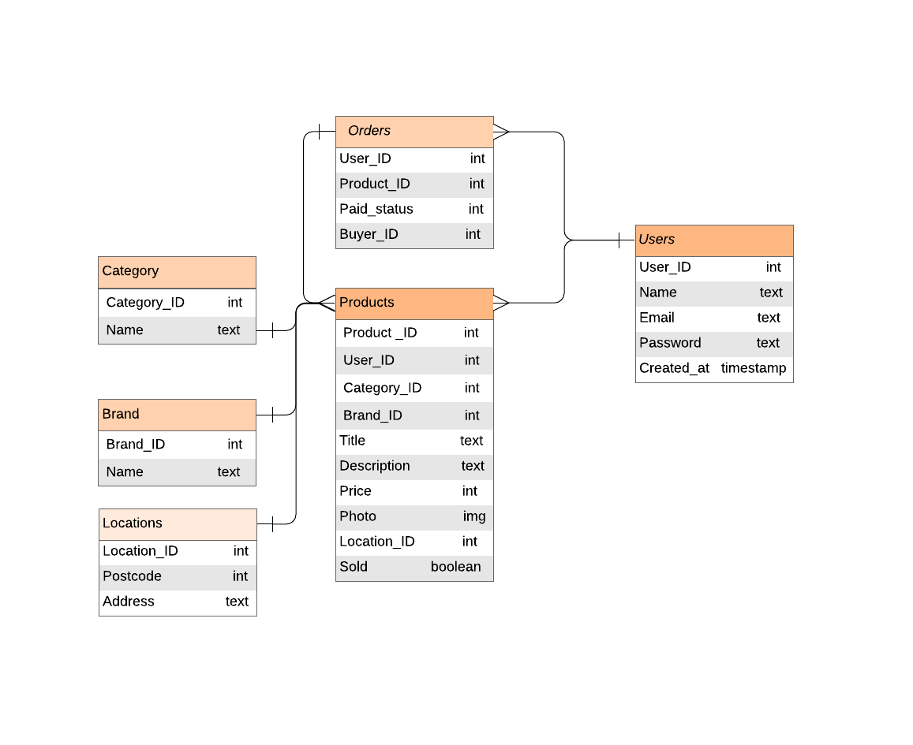
* Provides coherent discussion of the database relations, with reference to the ERD
I wanted the Brand, Categories and Locations not to be reliant on anything. Brand and Categories both only have a name coloumn and from here they use forigen keys to link to the Products table. This is almost identical for the location table but it has 2 columns. I wanted the locations table to be independant from the user incase the user was to sell an item for someone else from a different address, this way they are not locking in and have more flexabiltiy, it also allows a user to post a listing without a location incase they really wanted and item and are happy to ship it no matter what the cost. The items can all have 0 or many products, but the products can only have one of each. Users can also have 0 or many products the same way they can have 0 or many orders but a product can only have one user. An order can only have one user but many products and a product can also only have one order. 

##### 6. Provide your database schema design.
* Flawless, complex, complete, and well thought through ERDs provided
Brand and category will have many products and will both have text data types.
Locations will have many products. Postcode will be an integer and address will be text.

Products will have a Product ID for orders, a user ID as a reference for orders. It will have the category and brancd ID as a reference. A title and description both will be text. Price will be an integer. Location ID will only show postcode so only an integer and finally sold which will be a boolean value.

Orders will have a user and buyer ID both as references. It will also have a Product ID as refernce and a Paid status which will be a boolean value.

Users will have a primary key. Name, email and password will all be text values and a created at timestamp. I will use the timestamp for the dashboard feature.
 

##### 7. Provide User stories for your App.

* You also just use normal markdown to describe them
* User stories are well thought out, relevant, and comprehensively cover the needs of the app
As a seller/buyer. I want to be able to login/signup to my account. So that I can view, create, edit and delete listings.
As a seller. I want to be able to create listings in my account. So that I can sell items online.
As a seller. I want to be able to upload an image of my items for sale. So I can have my user engagement. 
As a seller. I want to view my own listings. So I can edit, update and delete listings.
As a seller. I want to be able to sell my product via a safe means. So I can have safe transactions. 
As a seller. I want my sold items to be deleted automatically. So I don’t have to manage sold items.

As a buyer. I want to be able to view listings from other accounts. So I can buy items online.
As a buyer. I want to be able to have a safe way to pay for items. So I can purchase with peace of mind.
As a buyer. I want to post WTB listings. So other people can find my ad and sell faster to me.

##### 8. Provide Wireframes for your App.
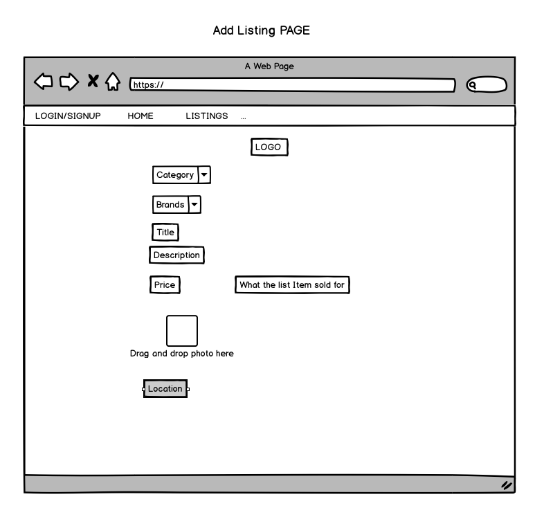  
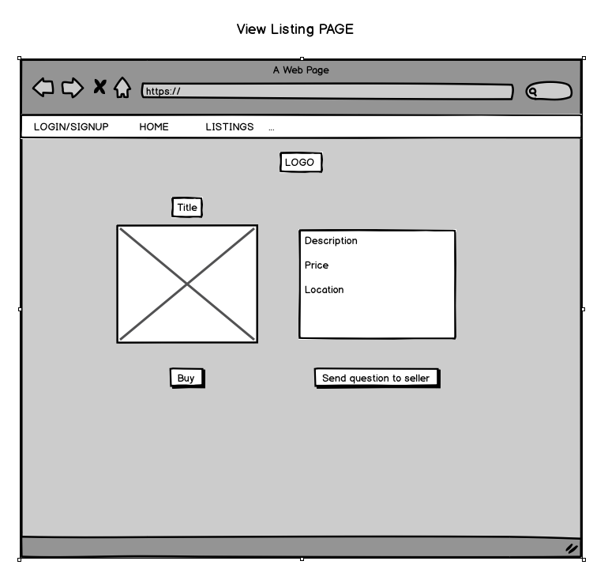  
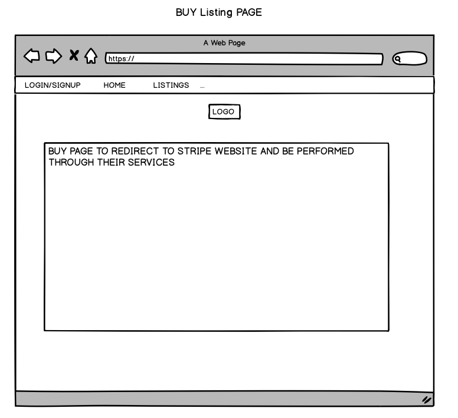  
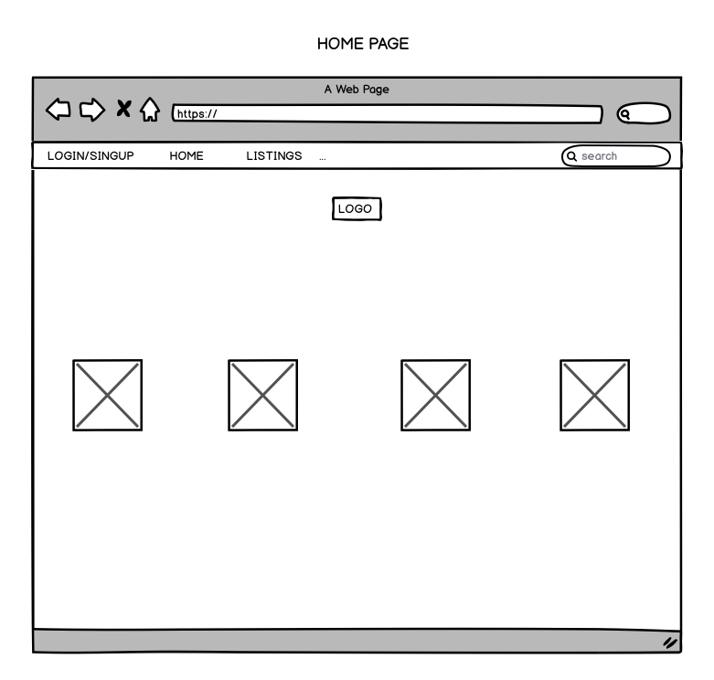  
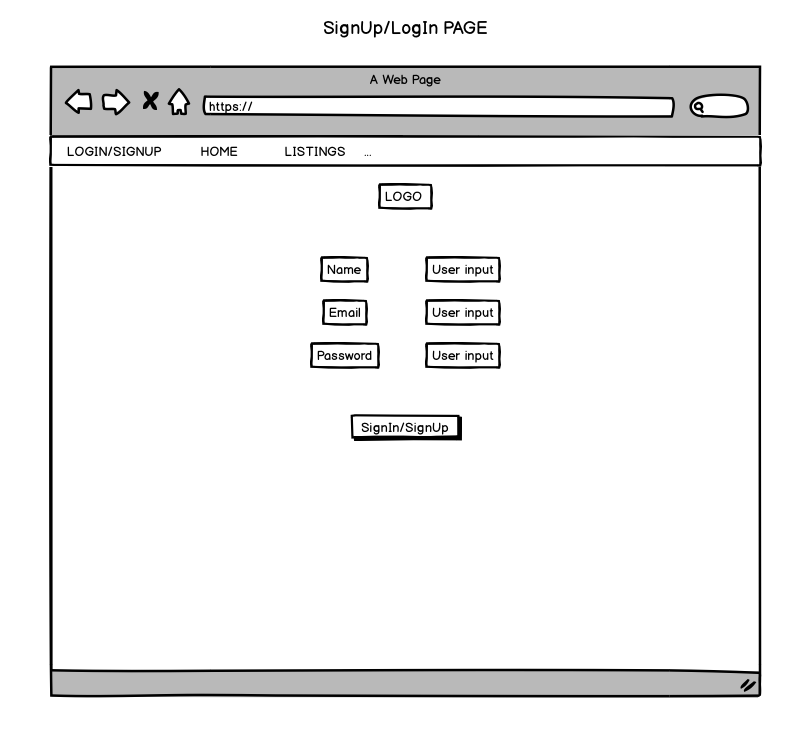
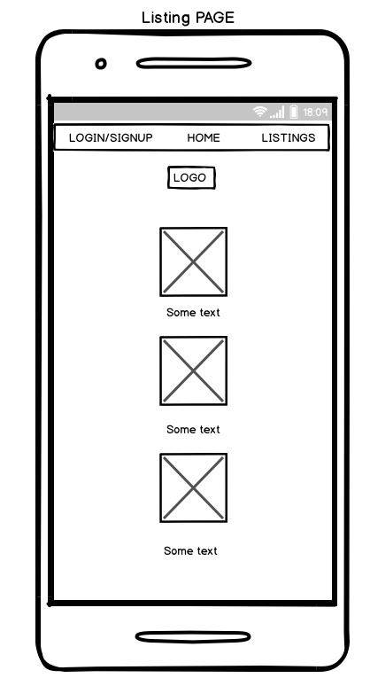 
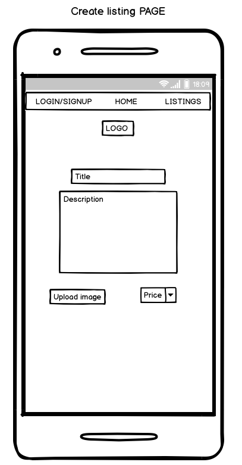 
* More than five detailed and well designed wireframes provided, for several different screen sizes (as required for the app)

##### 9. Describe the way tasks are planned and tracked in your project.
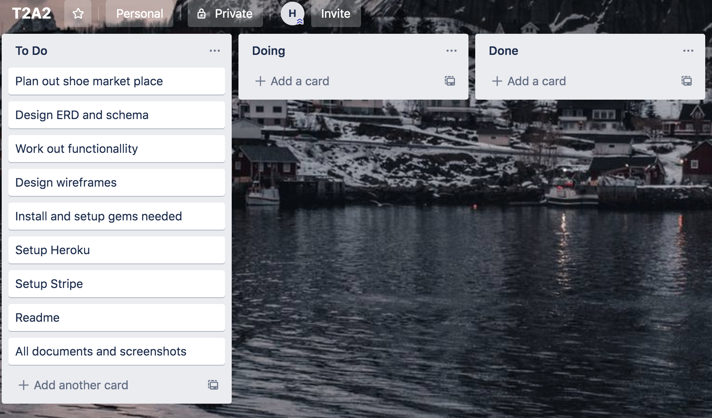
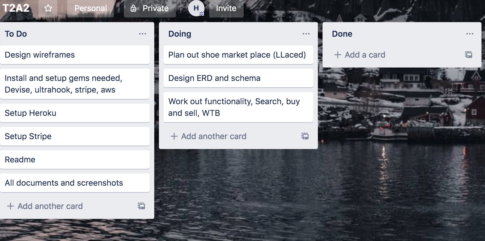
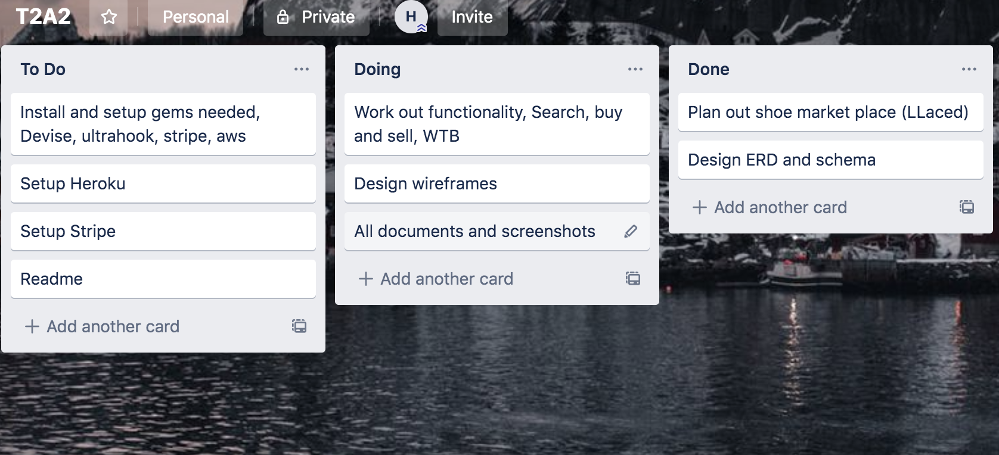
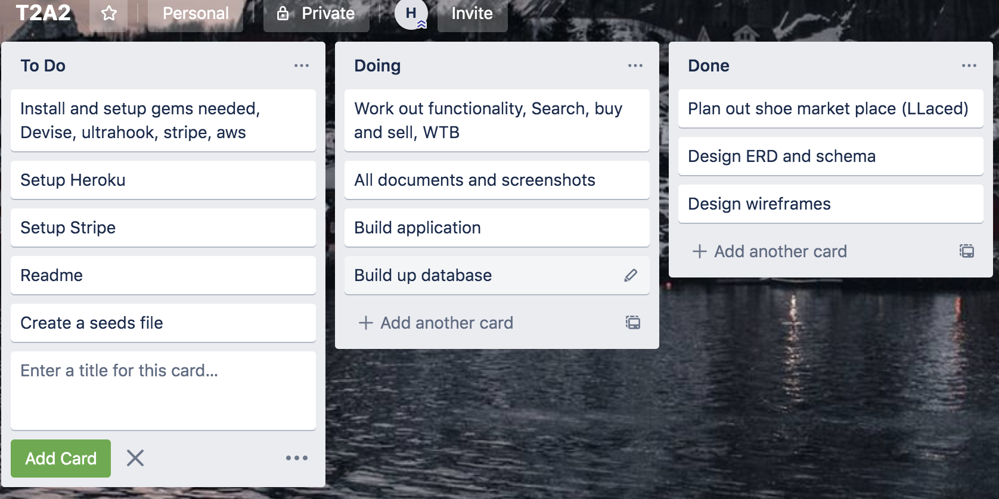
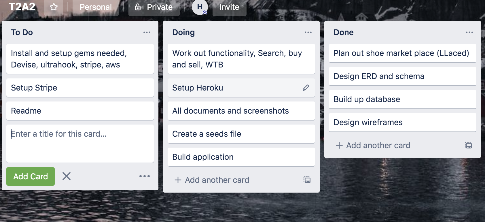
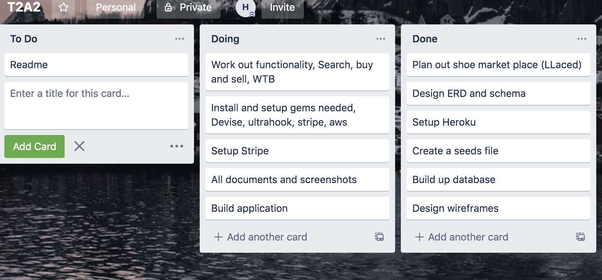
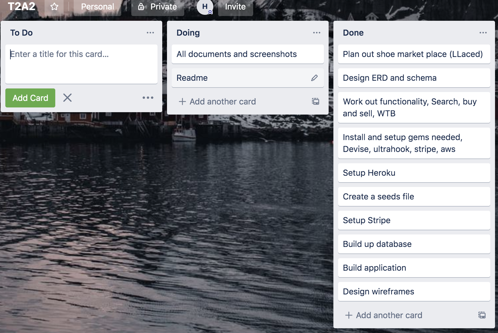
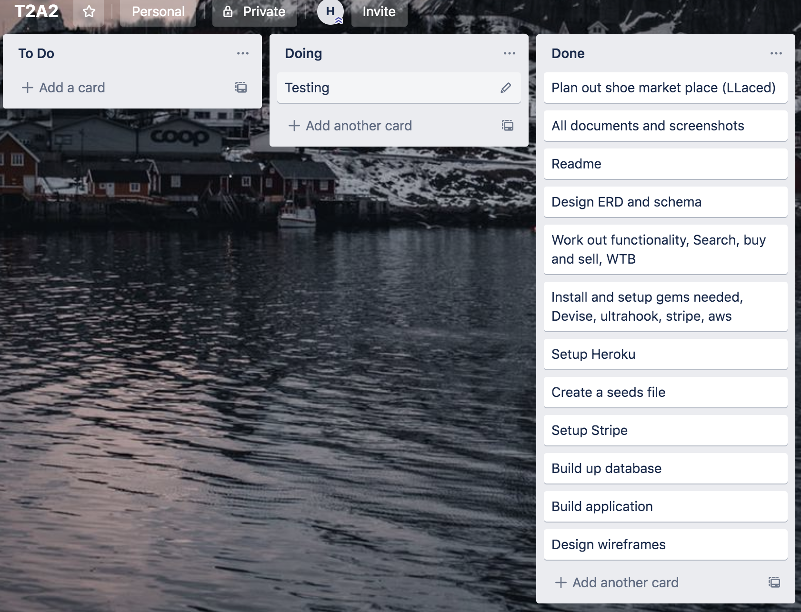
* Shows significant planning for how tasks are planned and tracked, including a full description of the process and of the tools used

I have used Trello board to help with planning as it allows me to change, add and delete things really easily and quickly. It makes it very easy to see what needs to be done and what is finished already. It it nice to have it on a second screen and move things to different column as I am programing I can easily keep up to date with where I am and what I need to be doing next. 
I first planned everything, once I have some what of an idea in my head i worked out the trello board and tried to place everything in order from top to bottom of what need to be done. Once I had an idea on the marketplace I then went to design my ERD and Schema to work out what relations I wanted. Next was the wireframes to get an idea of what I wanted it to look like.
After this it was all programing, building the models and controllers, from there installing all the gems and 3rd party software I need to make the apllication work. Once the app was deployed and working I then moved on to the readme and making sure all the documentation was completed.

##### 10. ERD provided represents a normalised database model.

* Meets D with no duplication and ideal definition of entities.

